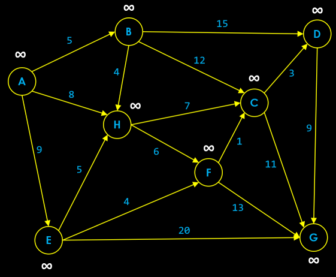

# Instructions  

### In this assignment you will implement Dijkstra's Algorithm to find the shortest path in a direct graph with positive edge weights. Dijkstra's Algorithm is a very famous and popular algorithm used for finding the shortest path. 

### Complete the following classes (refer to each class for details).
```Java
 public class Vertex
 public class Edge
 public class Main
 public class DijkstrasAlgorithm
 
 ```
### Add the following graph to the data.txt file. 
The first line should contain all the vertex names seperated by a space. Each line after should contain a single edge in the following format, source vertex name, target vertex name, and weight.

### Find the shortest path from A to G. 
