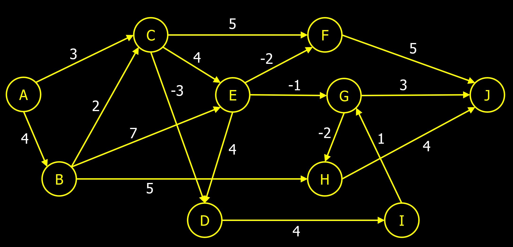

# Instructions  

### In this assignment you will learn how to find the shortest path in a Topological Ordered Direct Acyclic Graph. Finding the shortest path is a common algorithm used with graph structures.

### Complete the following classes (refer to each class for details).
```Java
 public class Vertex
 public class Edge
 public class Main
 public class TopologicalOrdering
 public class ShortestPath
 
 ```
### Add the following graph to the data.txt file. 
The first line should contain all the vertex names seperated by a space. Each line after should contain a single edge in the following format, source vertex name, target vertex name, and weight.

For this graph you will find the shortest path from A to J. 

### Challege: See if your algorithm can find the longest path. Only one line of code would need to be changed.


  