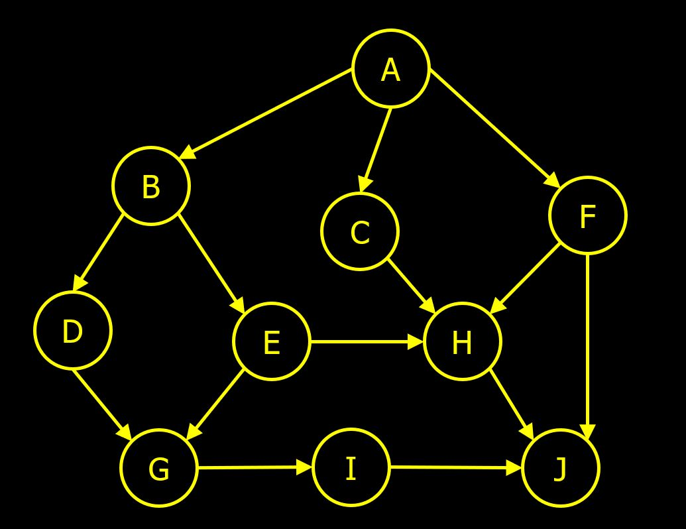

# Instructions  

In this assignment you will use a depth first search algorithm to create a topological ordering of a directed acyclic graph (DAG). 

Complete the following classes
```Java
 public class Main
 public class Vertex
 
 ```
 Complete the Main class using this directed acyclic graph (DAG)

Example output:
```Java
[A, F, C, B, E, H, D, G, I, J]
 ```
  