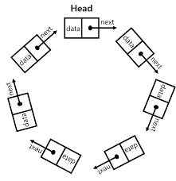
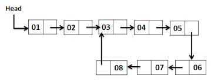

# Instructions  

The CircularSinglyLinkedList class represents a circular singly linked list of integers. The last Node in the linked list will have its next field pointing to head instead of null.




The CircularSinglyLinkedList class should have head as the only instance variable.

```java
    Node head = null;
```
The method hasCycle should detect and return true if the given linked list is circular or has a cycle. A linked list containing a cycle occurs when the last nodes's next field refers to a node other than head. For example, in the diagram below the last node does not link to head but links to the node containing the 3.



Implement the following methods in the CircularSinglyLinkedList class

```java
    /**
     * Adds a new Node at the end of the circular Linked 
     * List. There is no tail or prev references so you 
     * will need to loop through the list to find the last 
     * Node that points to back to head. The new Node's 
     * next field should refer to the head.
     */
    public Node add(int num)

    /**
     * Returns the distance from head to the next Node 
     * containing the value of num.  For example, if 
     * the value of num is found in the head node then
     * 1 is returned. Return -1 if num is not found.
     */
    public int distanceFromHead(int num)

    /**
     * Removes the first occurance of the given num and 
     * returns true. Returns false if num is not found.
     */
    public boolean remove(int num)

    /**
     * Returns true if the given head of a singly 
     * linked list is circular or has a cycle. A
     * circular linked list has the last node refering 
     * to the head. A linked list containing a cycle has
     * a node refering to a previous node (other than
     * head) in the linked list. Returns false if the
     * linked list is not circular nor contains a cycle.
     */
    public static boolean hasCycle(Node otherHead)

    /**
     * The toString method should return a String 
     * containing all of the integers in the list in 
     * the correct order with the value at the head 
     * at the front. For example.  [7, 23, 17, 19]
     */
    public String toString()
```


  