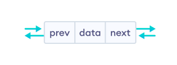
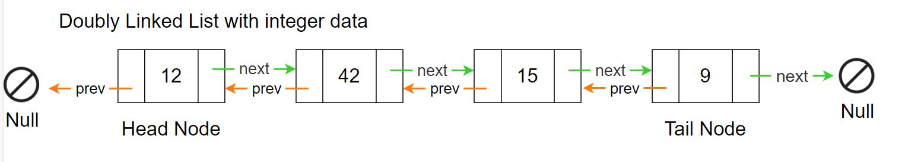
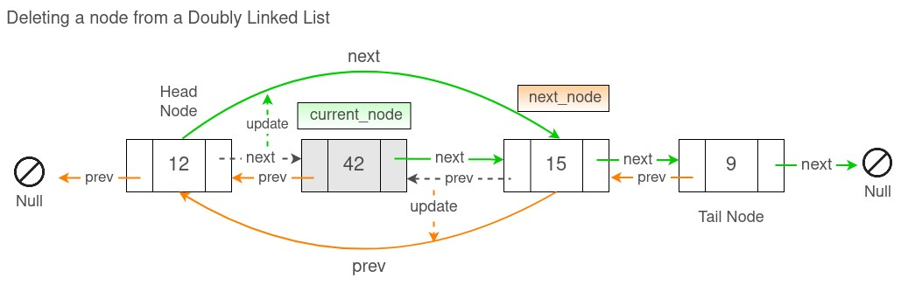

# Instructions  

The MyDeque class represents a doubly linked list of integers called a Deque. The name deque is short for "double ended queue" and is usually pronounced "deck". A deque is a linear collection that supports element insertion and removal at both the head and tail. A doubly linked list will have both head and tail reference variables. 

In addition to next, each node will have a field called prev that contains the address of the previous node. The addition of a tail reference and a field for the previous node allows for the traveral of a doubly linked list in either direction. The Node class is implemented as an inner class in your MyDeque class. This is often done when the objects of the inner class is not needed outside the enclosing class.





Your MyDeque should have only two instance variables.
```java
    Node head
    Node tail
```
In your MyDeque class only even values will be added at the front of the list while only odd values will be added at the end. Use the main method to test and debug your methods.  
Methods to implement are;

  ```java
   /**
     * Adds even value at the head of the list and returns true.
     * Odd values are ignored and the method returns false.
     */
    public boolean addEven(int num)

    /**
     * Adds odd value at the tail of the list and returns true.
     * Even values are ignored and the method return false.
     */
    public boolean addOdd(int num)

    /**
     * Returns the value of the first element in the list. 
     * Throw NoSuchElementException if the list is empty.
     */
    public int getFirst()

    /**
     * returns the value of the last element in the list. 
     * Throw NoSuchElementException if the list is empty.
     */
    public int getLast()

    /**
     * Removes and returns the first element in the list.
     * Throw NoSuchElementException if the list is empty.
     */
    public int removeFirst()

    /**
     * Removes and returns the last element in the list.
     * Throw NoSuchElementException if the list is empty.
     */
    public int removeLast()

    /**
     * Returns true if the list is empty otherwise false.
     */
    public boolean isEmpty()

    /**
     * Returns the distance from the head to the given num 
     * if num is even. If num is odd then it returns the 
     * distance from tail. Returns -1 if num does not exist 
     * in the list. For example. list = [8, 6, 4, 7, 3, 5, 3]
     * list.contains(4)  returns 3
     * list.contains(3)  returns 1
     * list.contains(2)  return -1
     */
    public int contains(int num)

    /**
     * Same as contains except it also removes the 
     * element from the list.
     */
    public int remove(int num)

    /**
     * The method is given another MyDeque list. Elements 
     * should be added to the head or tail depending on 
     * whether they are even or odd values. Note: Create new 
     * Nodes and add them to this MyDeque. For example.
     * listA = [4, 2, 1, 3]  listB = [8, 6, 7, 5]
     * listA.merge(listB) 
     * listA = [6, 8, 4, 2, 1, 3, 7, 5]
     */
    public void merge(MyDeque other)

    /**
     * Returns a String containing all the values in the list.
     * For example.  [10, 8, 6, 4, 2, 1, 3, 5, 7, 9]
     */
    public String toString()

    
  ```