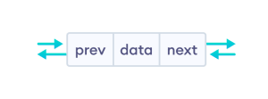
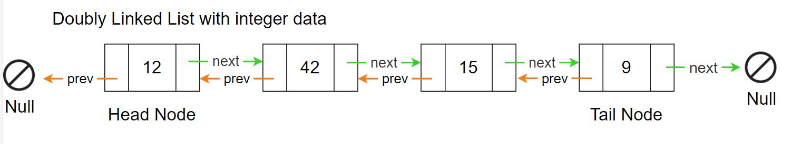
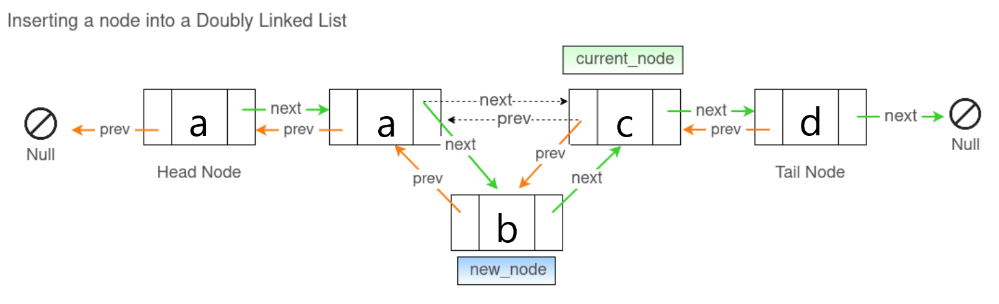

# Instructions  

The MyDoublyLinkedList class represents a doubly linked list of characters. A doubly linked list will have both head and tail reference variables. Each Node will have a reference to the previous and next Node. The Node class is implemented as an inner class in your MyDoublyLinkedList class. This is often done when the objects of the inner class is not needed outside the enclosing class.




Your MyDoublyLinkedList should have only two instance variables.
```java
    Node head
    Node tail
```
In your MyDoublyLinkedList class each node will store an individual charater. Nodes should be inserted in alphanumerical order. 


Use the main method to test and debug your methods.  

```Hint: You should use the String method toCharArray(). This method returns a newly allocated character array whose length is the length of this string and whose contents are initialized to contain the character sequence represented by this string.```

### Methods to implement are;
```java
/**
 * The method takes a given string and adds a node to 
 * the list for each character in the string. For
 * example, if the given string contains 10 characters 
 * then the method should add 10 nodes to the list. 
 * Characters should be inserted into the linked list
 * in alphanumerical order.
 */
public void add(String str)

/**
 * The method removes duplicate characters from the 
 * list and returns the duplicate characters as a 
 * string. The string returned in the order they are
 * removed starting with the head. For example, if 
 * the list contains nodes "abcccdde" then the list 
 * would contain "abcde" after completion and return 
 * a string containing "ccd".
 */
public String removeDuplicates()

/**
 * Returns true if the linked list contains ALL the
 * characters in the given string, otherwise it 
 * returns false. The characters in the given string
 * may not be in alphanumerical order. Duplicate 
 * characters in the given string only need to appear
 * once in the linked list.
 */
public boolean contains(String str)

/**
 * Removes the characters in the given string from 
 * the list. Characters in the given string may not 
 * be in alphanumerical order. If a character in the
 * given string is not in the list then it is ignored.
 * Only one character should be removed from the list 
 * for each character in the given string. The method  
 * should return a count of the how many nodes have  
 * been removed from the linked list.
 */
public int remove(String str)

/**
 * The method returns the data from all the nodes as
 * a single String. The character at the head should  
 * be at index 0. No commas or square brackets needed. 
 * Note: You must implement a full traversal from
 * the head to earn credit.
 */
public String toString()

/**
 * The method returns the data from all the nodes as
 * a single String. The character at the tail should  
 * be at index 0. No commas or square brackets needed. 
 * Note: You must implement a full traversal from
 * the tail to earn credit.
 */
public String toStringReversed()

```