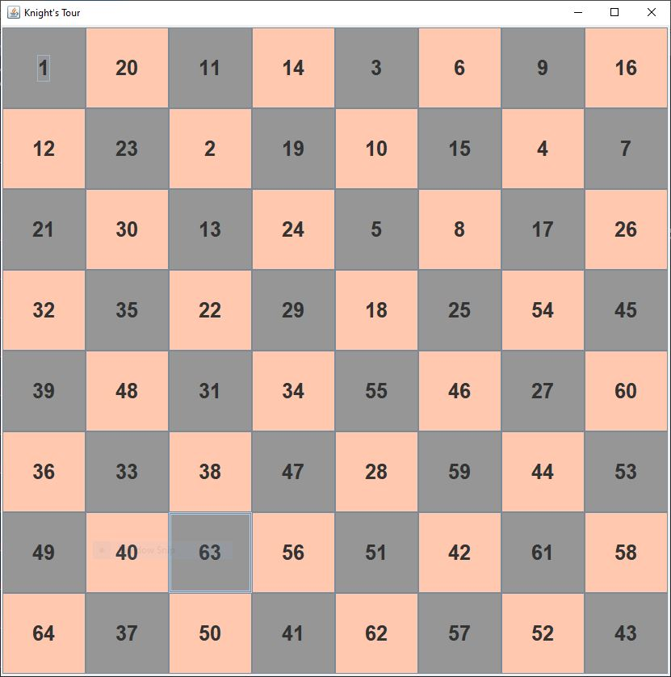

# Instructions  

## Complete the method tour in the KnightsTour class

  ### Steps
  1. Add a base case where count equals 64
  2. Add 8 conditional recursive calls, one for each direction a knight can move.

Your output should fill up the board with number 1 through 64. For example,

